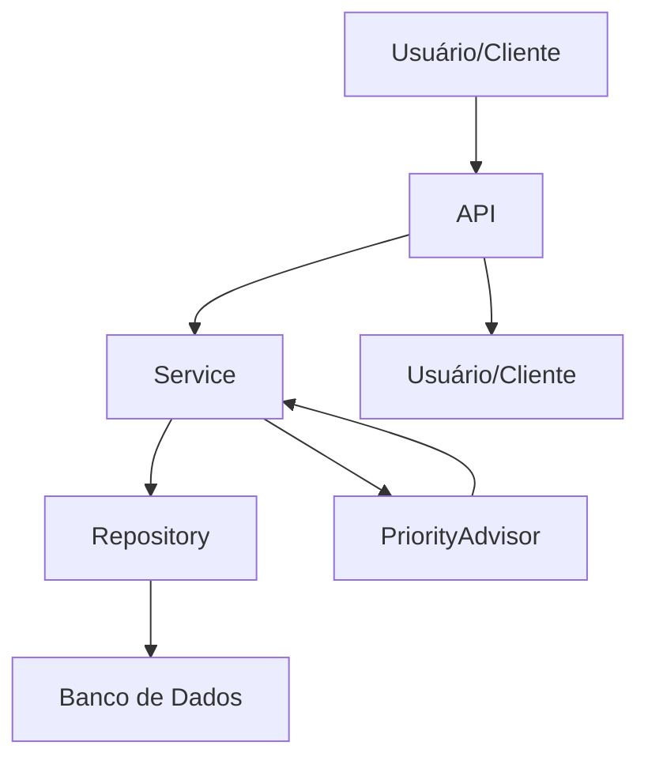

# Controle de Estudos – Micro-API

Uma micro-API REST para gestão de controle de estudos, desenvolvida com FastAPI. Permite o gerenciamento de trilhas de estudo, cursos associados e atividades de estudo, com foco em rastreabilidade e organização do progresso acadêmico para estudantes de pós-graduação.

## Funcionalidades

- **CRUD de Trilhas**: Criar, listar, atualizar e remover trilhas de estudo.
- **CRUD de Cursos**: Gerenciar cursos vinculados a trilhas.
- **CRUD de Atividades**: Controlar atividades de estudo por curso, incluindo status de conclusão e revisão.
- **Sugestão de Prioridade**: Recomendação da próxima atividade usando heurística local ou IA (OpenAI GPT-4o-mini, opcional).
- **Healthcheck**: Endpoint para monitoramento de disponibilidade.
- **Documentação Interativa**: Swagger/OpenAPI em `/docs`.

## Arquitetura

A aplicação segue uma arquitetura em camadas para separação de responsabilidades:

```
Cliente → API (FastAPI) → Service → Repository → Banco de Dados
                    ↓
              PriorityAdvisor (Heurística/IA)
```

- **API**: Rotas e validação de entrada/saída com Pydantic.
- **Service**: Regras de negócio e coordenação.
- **Repository**: Acesso a dados (SQLite).
- **PriorityAdvisor**: Sugestão de atividades com fallback seguro.

### Diagrama de Fluxo



## Instalação

### Pré-requisitos
- Python 3.11.x
- Git
- Ambiente virtual (`venv`)

### Passos
1. **Clone o repositório**:
   ```bash
   git clone <url-do-repositorio>
   cd controle-estudos
   ```

2. **Crie e ative o ambiente virtual**:
   ```bash
   python -m venv .venv
   source .venv/bin/activate  # Linux/Mac
   # ou
   .venv\Scripts\activate    # Windows
   ```

3. **Instale as dependências**:
   ```bash
   pip install -r requirements.txt
   ```

4. **Copie o arquivo de exemplo de ambiente**:
   ```bash
   copy .env.example .env      # Windows
   cp .env.example .env        # Linux/Mac
   ```

5. **Configure variáveis de ambiente**:
   - `OPENAI_API_KEY`: chave opcional da OpenAI
   - `OPENAI_MODEL`: modelo de IA a ser usado
   - `PRIORITY_ADVISOR_TIMEOUT_SECONDS`: timeout em segundos para chamada externa

> O SQLite é usado como persistência local e não requer instalação adicional se o Python já estiver disponível.

## Execução

1. **Inicie o servidor**:
   ```bash
   python -m uvicorn app.main:app --reload --host 127.0.0.1 --port 8000
   ```
   ou, se estiver usando o `Makefile`:
   ```bash
   make run
   ```

2. **Acesse a aplicação**:
   - API: [http://127.0.0.1:8000](http://127.0.0.1:8000)
   - Documentação: [http://127.0.0.1:8000/docs](http://127.0.0.1:8000/docs)
   - Healthcheck: [http://127.0.0.1:8000/health](http://127.0.0.1:8000/health)

> Se quiser alterar host ou porta, ajuste os parâmetros `--host` e `--port` no comando do Uvicorn.

## Testes

Execute os testes automatizados com pytest:

```bash
pytest
```

ou usando o `Makefile`:

```bash
make test
```

### Cobertura
- Testes unitários para serviços (`ControlService`, `PriorityAdvisor`).
- Testes de integração para rotas (usando `TestClient`).
- Cenários: CRUD, validações, erros (404, 400), fallback de IA.

Para executar testes específicos:
```bash
pytest tests/test_control_service.py
pytest tests/test_priority_advisor.py
pytest tests/test_control_routes.py
```

## Endpoints da API

### Trilhas
- `POST /api/v1/trilhas` - Criar trilha
- `GET /api/v1/trilhas` - Listar trilhas
- `GET /api/v1/trilhas/{id}` - Obter trilha por ID
- `PUT /api/v1/trilhas/{id}` - Atualizar trilha
- `DELETE /api/v1/trilhas/{id}` - Remover trilha

### Cursos
- `POST /api/v1/cursos` - Criar curso
- `GET /api/v1/cursos` - Listar cursos
- `GET /api/v1/cursos/{id}` - Obter curso por ID
- `PUT /api/v1/cursos/{id}` - Atualizar curso
- `DELETE /api/v1/cursos/{id}` - Remover curso

### Atividades
- `POST /api/v1/atividades` - Criar atividade
- `GET /api/v1/atividades` - Listar atividades
- `GET /api/v1/atividades/{id}` - Obter atividade por ID
- `PUT /api/v1/atividades/{id}` - Atualizar atividade
- `DELETE /api/v1/atividades/{id}` - Remover atividade

### Outros
- `GET /health` - Healthcheck

## Integração com IA

O `PriorityAdvisor` sugere a próxima atividade usando heurística local e pode chamar a OpenAI quando configurado.

### Configuração
- `OPENAI_API_KEY`: chave opcional da OpenAI.
- `OPENAI_MODEL`: modelo para chamadas de IA (`gpt-3.5-turbo`, por exemplo).
- `PRIORITY_ADVISOR_TIMEOUT_SECONDS`: timeout em segundos para a chamada externa.

### Comportamento
- Sem `OPENAI_API_KEY`: o sistema roda com heurística local, sem custo adicional.
- Com chave: tenta usar a OpenAI e respeita `PRIORITY_ADVISOR_TIMEOUT_SECONDS`.
- Se a chamada à OpenAI falhar ou estourar o timeout, o fallback seguro retorna a sugestão local.

### Exemplo de Uso
```python
from app.services.priority_advisor import PriorityAdvisor

advisor = PriorityAdvisor()
atividades = [
    {"id_atividade": 1, "id_curso": 1, "descricao_atividade": "Estudar listas", "estudo_concluido": False, "revisao_finalizada": False}
]
sugestao = advisor.suggest_proxima_atividade(atividades, use_llm=True)
```

### Observações
- A integração é opcional e não bloqueia o funcionamento da API.
- Use `OPENAI_MODEL` para controlar o modelo de IA desejado.
- Mensagens de erro da chamada externa são tratadas internamente e não impactam a experiência CRUD básica.

## Limitações

- **Banco de Dados**: SQLite (MVP); não escalável para produção.
- **Autenticação**: Não implementada (planejada para Release 2).
- **Usuários**: Gestão de estudantes não incluída no MVP.
- **IA**: Dependente de chave OpenAI; sem chave, funcionalidade limitada.
- **Desempenho**: Não otimizado para alta carga.
- **Segurança**: Sem validações avançadas ou rate limiting.

## Próximos Passos

### Release 2: Qualidade
- [ ] Estrutura modular aprimorada (DRY/SRP).
- [ ] Testes automatizados completos.
- [ ] Logs estruturados e tratamento de erros.
- [ ] Autenticação básica.

### Release 3: Entrega Final
- [ ] Migração para PostgreSQL.
- [ ] Deploy em cloud (ex: Railway, Render).
- [ ] Interface web simples (opcional).
- [ ] Monitoramento avançado.

### Melhorias Futuras
- Suporte a múltiplos usuários.
- Notificações e lembretes.
- Análise de progresso com gráficos.
- Integração com plataformas de e-learning.

## Contribuição

1. Fork o projeto.
2. Crie uma branch para sua feature (`git checkout -b feature/nova-funcionalidade`).
3. Commit suas mudanças (`git commit -m 'feat: adiciona nova funcionalidade'`).
4. Push para a branch (`git push origin feature/nova-funcionalidade`).
5. Abra um Pull Request.

Siga Conventional Commits e mantenha testes atualizados.

## Licença

Este projeto é licenciado sob a MIT License. Veja o arquivo `LICENSE` para detalhes.