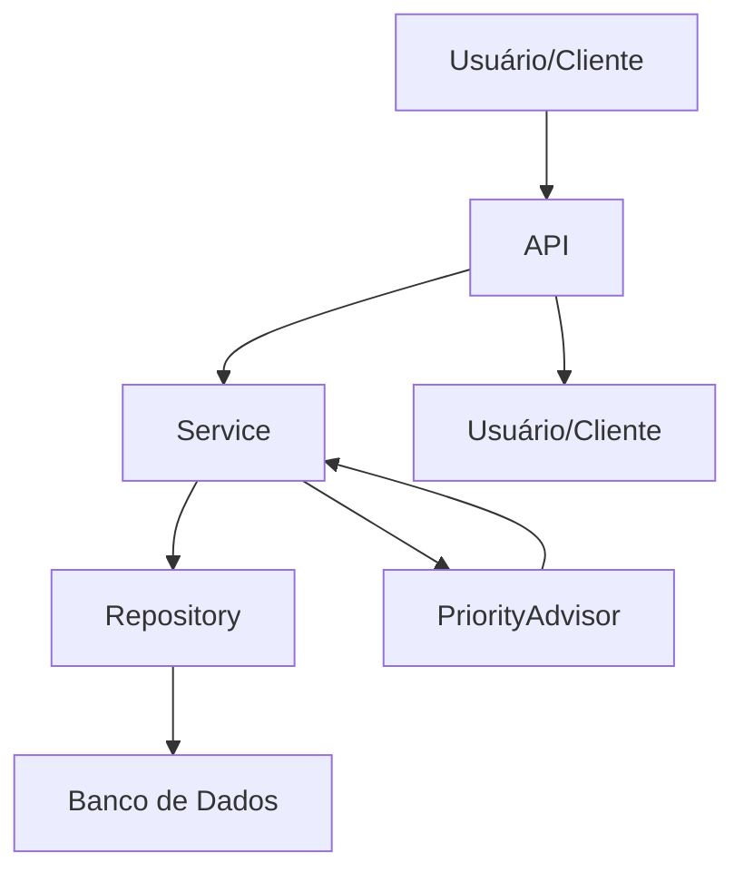

```mermaid
flowchart TD
    ClientIn["Usuário/Cliente"] --> API["API"]
    API --> Service["Service"]
    Service --> Repository["Repository"]
    Repository --> DB["Banco de Dados"]
    Service --> PriorityAdvisor["PriorityAdvisor"]
    PriorityAdvisor --> Service
    API --> ClientOut["Usuário/Cliente"]
```
